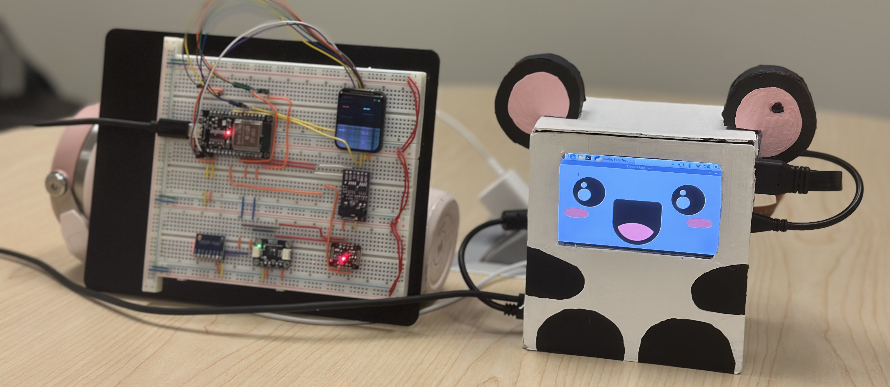
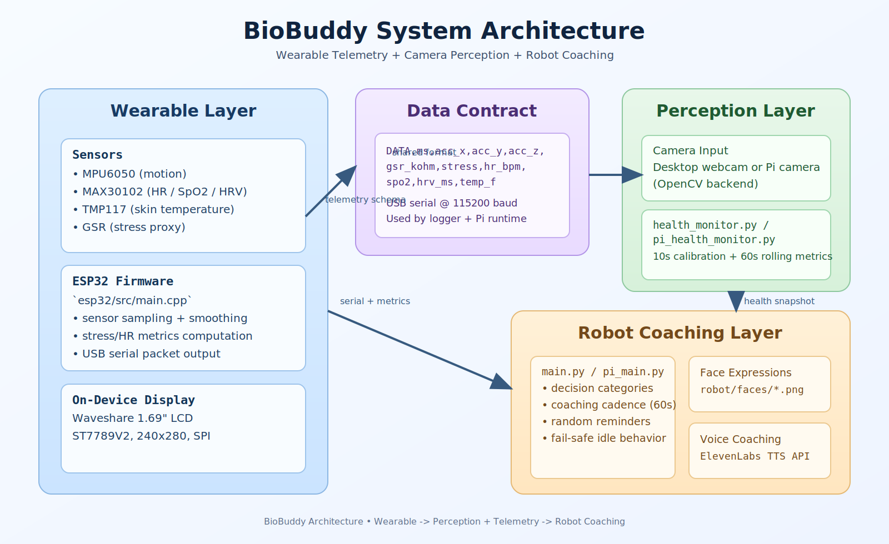

# BioBuddy
Wearable + Robot Wellness Coach  
EMBS Design Team - Spring 2026



BioBuddy is a multimodal wellness system made of three tightly-coupled parts:
- A wearable biometric device on ESP32
- A camera-based perception pipeline for posture and eye-state monitoring
- A robot interface that provides visual and voice coaching

This README is written as a team handoff document so every member can understand the full project, not just their own subsystem.

## Quick Navigation
- [What This System Does](#what-this-system-does)
- [Repository Layout](#repository-layout)
- [System Architecture Diagram](#system-architecture-diagram)
- [End-to-End Architecture](#end-to-end-architecture)
- [Hardware Used](#hardware-used)
- [Subsystem Ownership and Responsibilities](#subsystem-ownership-and-responsibilities)
- [Data Contracts and Runtime Behavior](#data-contracts-and-runtime-behavior)
- [Setup](#setup)
- [Run Modes](#run-modes)
- [Troubleshooting](#troubleshooting)
- [Known Constraints](#known-constraints)

## What This System Does

BioBuddy continuously monitors physiology and behavior signals, then generates coaching feedback in real time.

Monitored signals:
- Motion (accelerometer)
- GSR-derived stress estimate
- Heart-related metrics (HR, SpO2, HRV)
- Skin temperature
- Posture quality and eye-closure behavior from camera input

System outputs:
- Live wearable display metrics
- Robot face expression changes
- Spoken coaching prompts
- Optional telemetry logging to CSV

## Repository Layout

```text
.
|- esp32/      # ESP32 firmware (PlatformIO + Arduino)
|- mia/        # ML/CV datasets, model artifacts, and training/demo scripts
|- robot/      # Robot runtime, monitors, face assets, coaching loop
|- wearable/   # Serial reader/logger + BLE utility scripts
|- images/     # README/demo assets
`- requirements.txt
```

## System Architecture Diagram



## End-to-End Architecture

```text
[Wearable Sensors]
MPU6050 + GSR + MAX30102 + TMP117
        |
        v
[ESP32 Firmware: esp32/src/main.cpp]
- sensor fusion + smoothing
- TFT rendering
- serial packet output (115200)
        |
        v
[USB Serial Telemetry]
DATA,ms,acc_x,acc_y,acc_z,gsr_kohm,stress,hr_bpm,spo2,hrv_ms,temp_f
        |
        +--> wearable/read_esp.py (terminal + CSV logger)
        |
        +--> robot/pi_main.py (HR overlay for robot UI)

[Camera Input] ---> [robot/health_monitor.py or robot/pi_health_monitor.py]
                   - 10s calibration
                   - posture + eye metrics (60s rolling window)
                           |
                           v
                   [robot/main.py or robot/pi_main.py]
                   - state classification
                   - face selection
                   - voice coaching (ElevenLabs)
```

## Hardware Used

### Core Compute and Sensor Hardware
| Component | Purpose | Notes |
|---|---|---|
| ESP32 dev board | Wearable controller | PlatformIO target: `esp32dev` |
| MPU6050 | Motion sensing | Accelerometer data included in telemetry |
| MAX30102 | Heart metrics | HR, SpO2, and HRV path |
| TMP117 | Skin temperature | Read over I2C |
| GSR interface | Stress proxy signal | Combined with motion for stress score |

### Display Hardware
| Component | Purpose | Interface |
|---|---|---|
| Waveshare 1.69" LCD Display Module (240x280, 262K colors, IPS, ST7789V2) | Wearable live dashboard | SPI |

Module details captured from team build:
- Product used: Waveshare 1.69inch LCD Display Module
- Resolution: 240x280
- Driver chip: ST7789V2
- Supported ecosystems: Raspberry Pi, Arduino, STM32, embedded
- Connection used in this project: SPI (ESP32 firmware in `esp32/src/main.cpp`)

## Subsystem Ownership and Responsibilities

### Team
Leads:
- Lincy Phipps
- Gael Garcia

Members:
- Ella Shelton
- Carson Phuong
- Mia Beltran
- Davey Collins
- Yoon Pan Eain
- Jocelin Santocki
- Roshni Padala

### Responsibility Map
| Subsystem | Primary Contributors | Main Deliverables | Key Files |
|---|---|---|---|
| Wearable sensing + display | Ella Shelton, Yoon Pan Eain | Sensor integration touchpoints, TFT display behavior, on-device UX visibility | `esp32/src/main.cpp` |
| Biometric signal integration | Carson Phuong, Davey Collins | MAX30102/TMP117 signal path, HR/SpO2/HRV reliability, calibration behavior | `esp32/src/main.cpp` |
| ML + perception | Mia Beltran | Posture model training assets, posture/eye feature logic, calibration strategy | `mia/posture_dataset.csv`, `mia/posture_model.pkl`, `mia/machine_learning_training_code`, `robot/health_monitor.py`, `robot/pi_health_monitor.py` |
| Robot interaction layer | Roshni Padala, Jocelin Santocki | Face expression mapping, coaching timing and message behavior, voice interaction flow | `robot/main.py`, `robot/pi_main.py`, `robot/faces/` |
| System integration + architecture | Lincy Phipps, Gael Garcia | Cross-module integration, telemetry standardization, runtime mode orchestration, BLE->USB serial decision | `robot/pi_main.py`, `wearable/read_esp.py`, `esp32/src/main.cpp` |

## Data Contracts and Runtime Behavior

### Serial Packet Contract (Wearable -> Host)
Format:

`DATA,ms,acc_x,acc_y,acc_z,gsr_kohm,stress,hr_bpm,spo2,hrv_ms,temp_f`

Field semantics:
- `ms`: uptime timestamp from ESP32 loop
- `acc_*`: MPU acceleration components
- `gsr_kohm`: galvanic skin resistance value
- `stress`: smoothed stress score (0-1)
- `hr_bpm`: heart rate estimate
- `spo2`: oxygen saturation estimate
- `hrv_ms`: RMSSD-style variability metric
- `temp_f`: skin temperature in Fahrenheit

### Perception Runtime Contract
Monitor implementations:
- Desktop: `robot/health_monitor.py`
- Pi: `robot/pi_health_monitor.py`

Both monitors provide:
- Calibration phase (posture + eye)
- Posture status (`bad` or healthy state)
- 60-second bad-posture accumulation
- Blink count and long-closure metrics
- Readiness state and error state reporting

### Coaching Runtime Contract
Robot runtimes:
- Desktop: `robot/main.py`
- Pi: `robot/pi_main.py`

Decision loop:
- Health snapshot sampled continuously
- Coaching evaluation interval defaults to 60 seconds
- Category-based prompt and face mapping (`mixed`, `fatigue_high`, `eye_strain`, `posture_major`, `posture_minor`, `healthy_checkin`)

## Setup

1. Create and activate a Python virtual environment (PowerShell):

```powershell
python -m venv venv
.\venv\Scripts\Activate.ps1
```

2. Install dependencies:

```powershell
pip install -r requirements.txt
```

3. Create `.env` in repo root for robot voice coaching:

```env
ELEVEN_LABS_API_KEY=your_api_key_here
```

Optional Pi runtime overrides:

```env
WEARABLE_SERIAL_PORT=/dev/ttyUSB0
WEARABLE_BAUD=115200
PI_ROBOT_LOG_LEVEL=INFO
```

## Run Modes

### Desktop Robot Mode
Runs camera monitor + face UI + voice coaching.

```powershell
python robot/main.py
```

### Raspberry Pi Robot Mode
Runs Pi camera monitor + wearable HR serial overlay + voice coaching.

```bash
libcamerify python robot/pi_main.py
```

If `libcamerify` is not required on your setup:

```bash
python robot/pi_main.py
```

### Wearable Serial Logger
Reads serial packets and logs `wearable/biomonitor_log.csv`.

```powershell
python wearable/read_esp.py
```

Note:
- `wearable/read_esp.py` and `wearable/test.py` default to `/dev/ttyUSB0`
- On Windows, update `PORT` to your COM port (example: `COM3`)

### ESP32 Firmware (Reference + Optional PlatformIO Attempt)

Firmware source is kept in this repo primarily so the team has a shared, versioned copy of the wearable code.
Current status:
- Upload/build flow is not guaranteed from this repository as-is.
- PlatformIO config is included, but may require additional local setup/tuning.
- Team development historically happened in Arduino IDE during the project timeline.

```powershell
cd esp32
pio run
pio run -t upload
pio device monitor -b 115200
```

If upload fails in your environment, treat `esp32/src/main.cpp` as the canonical source archive for the firmware logic.

## Cross-Team Onboarding Path

If you worked mostly in one area and want to quickly understand the rest:

1. Read `esp32/src/main.cpp` first to understand telemetry fields at the source.
2. Read `robot/health_monitor.py` or `robot/pi_health_monitor.py` to see how camera metrics are produced.
3. Read `robot/main.py` to understand how monitor output turns into coaching actions.
4. Run `python wearable/read_esp.py` and `python robot/main.py` to observe data + behavior in real time.

## Troubleshooting

- Error: `Missing required env var: ELEVEN_LABS_API_KEY`
- Fix: add key to root `.env`, then restart.

- Camera not detected in Pi mode
- Fix: verify camera device and permissions; prefer `libcamerify python robot/pi_main.py`.

- HR overlay missing in Pi mode
- Fix: verify `WEARABLE_SERIAL_PORT` and `WEARABLE_BAUD`.

- Model/task files missing
- Fix: ensure these exist in `mia/`:
  - `posture_model.pkl`
  - `pose_landmarker_lite.task`
  - `face_landmarker.task`

## Known Constraints
- USB serial is currently the reliable telemetry transport used in integration.
- Camera framing and lighting strongly affect posture/eye inference quality.
- Calibration quality directly affects coaching quality.
- `wearable/read_esp.py` uses `clear` for terminal refresh, which is best on Unix-like shells.
- ESP32 upload/build reproducibility from this repo is not fully validated across environments.

## Acknowledgments
Built by the EMBS Design Team, Spring 2026.
